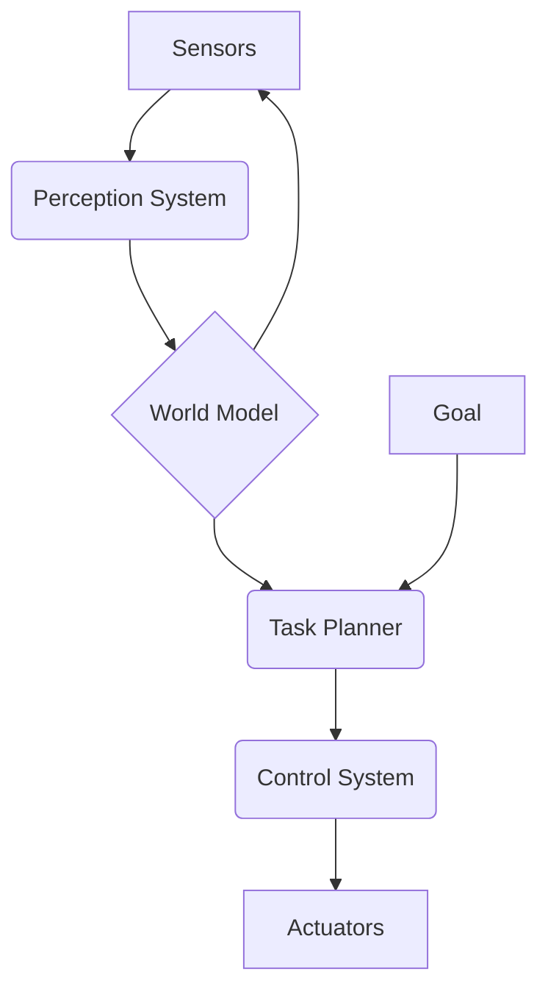

# Chapter 1: Introduction to AI-Powered Humanoids

Welcome to the first chapter of Module 3. In this chapter, we will introduce the concept of an AI-powered humanoid robot and its core architectural components.

## The Architecture of a Humanoid AI Brain

An AI-powered humanoid robot is a complex system that integrates perception, planning, and action to perform tasks in the real world. The "brain" of such a robot can be thought of as a cognitive architecture that processes sensory information and makes decisions.

The key components of this architecture are:

1.  **Perception System**: This is the robot's connection to the world. It processes data from various sensors like cameras, LiDAR, and IMUs to understand its environment.
2.  **World Model**: The perception system's output is used to build and maintain a "world model," which is an internal representation of the environment, the robot's own state, and the state of other objects.
3.  **Task Planner**: Based on the world model and a given goal, the task planner decides what actions the robot should take. This can range from high-level decisions (e.g., "go to the kitchen") to low-level motion planning.
4.  **Control System**: This system takes the decisions from the task planner and translates them into motor commands for the robot's actuators.

Here is a diagram illustrating the data flow between these components:

*(Note: The above is a placeholder for a more detailed diagram)*

## Cognitive Core Concepts

The "cognitive core" refers to the set of AI and machine learning algorithms that enable the robot's intelligent behavior. These include:

-   **Computer Vision**: For object detection, recognition, and scene understanding.
-   **Simultaneous Localization and Mapping (SLAM)**: To build a map of an unknown environment while simultaneously keeping track of the robot's location within it.
-   **Navigation and Path Planning**: To find a safe and efficient path from a starting point to a goal.
-   **Reinforcement Learning**: To learn complex behaviors through trial and error.

Throughout this module, we will explore how these concepts are implemented using NVIDIA's Isaac platform, particularly Isaac Sim for simulation and Isaac ROS for accelerated perception.

This chapter builds upon the ROS 2 concepts you learned in Module 1. The perception, planning, and control components are all implemented as ROS 2 nodes, communicating with each other using topics, services, and actions.