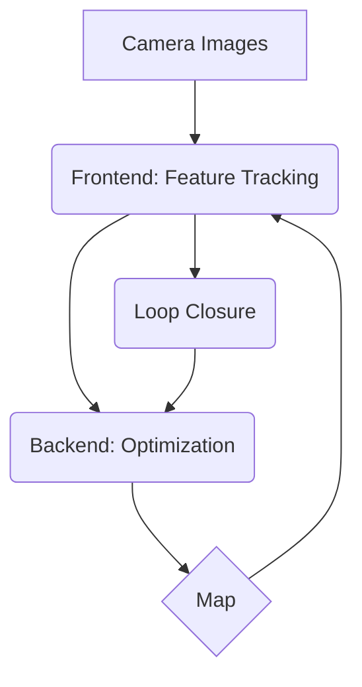

# Chapter 5: Visual SLAM

This chapter introduces Visual Simultaneous Localization and Mapping (Visual SLAM), a technique that allows a robot to build a map of its environment and track its own position within that map using only camera data.

## Core Concepts of Visual SLAM

Visual SLAM systems typically consist of the following components:

1.  **Frontend**: This part processes the raw sensor data (images) to extract keypoints and track them across consecutive frames. This tracking provides a motion estimate.
2.  **Backend**: The backend takes the motion estimates from the frontend and optimizes the robot's trajectory and the map of keypoints. This is often done using techniques like bundle adjustment to minimize re-projection errors.
3.  **Loop Closure**: This component detects when the robot has returned to a previously visited location. A successful loop closure can significantly reduce the accumulated drift in the map and trajectory.
4.  **Mapping**: The system builds a representation of the environment, which can be a sparse point cloud of keypoints, a dense map, or an object-based map.

Here is a diagram illustrating the Visual SLAM pipeline:



*(Note: The above is a placeholder for a more detailed diagram)*

## Applied Walkthrough with Isaac Sim

We will now use Isaac Sim and the Isaac ROS vSLAM node to perform Visual SLAM in a simulated environment.

1.  **Launch the Simulation**: Start Isaac Sim and load a scene with a robot equipped with a stereo camera.
2.  **Launch the vSLAM Node**: Use a ROS 2 launch file to start the Isaac ROS vSLAM node. This node will subscribe to the stereo camera topics from the simulation.

```python
from launch import LaunchDescription
from launch_ros.actions import Node

def generate_launch_description():
    return LaunchDescription([
        # Start the Isaac ROS vSLAM node
        Node(
            package='isaac_ros_visual_slam',
            executable='isaac_ros_visual_slam',
            name='isaac_ros_visual_slam',
            parameters=[{'use_sim_time': True}],
            remappings=[
                # Remap topics to match the simulation
            ]
        ),
        # Add other nodes, like a robot teleoperation node
    ])
```
3.  **Drive the Robot**: Teleoperate the robot to move around the environment. As the robot moves, the vSLAM node will build a map and publish the robot's estimated pose.
4.  **Visualize the Output**: Use RViz2 to visualize the map (as a point cloud) and the robot's trajectory. You should see the map being built in real-time as the robot explores.

This walkthrough demonstrates the power of Visual SLAM for enabling autonomous navigation in unknown environments.